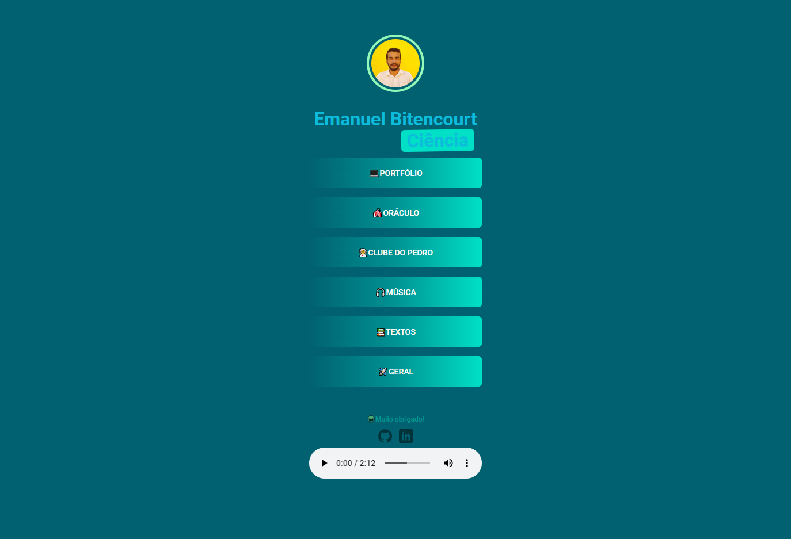

# Links úteis

Projeto construído apartir da Maratona explorer 2.0 na plataforma Rocketseat.

[Acesse aqui](https://emanuel433.github.io/links-uteis/)

## 👨‍🚀Tecnologias

- HTML
- CSS

Aprendi a criar uma página de links úteis que achei muito útil no meu instagram. Adicionei os efeitos rotate words com o uso da keyframes aprendidos nessa rede social, e gostei do resultado até o presente momento.

Tem implementado também o uso da tag áudio autoplay para versões compatíveis!
